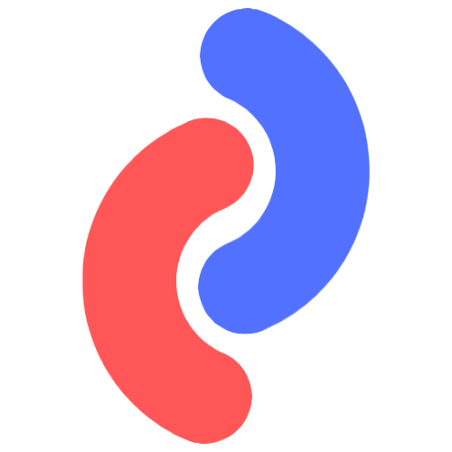

<div align="center">
    
</div>

# Epi Calendar

## Requirements

1. Node JS 16.17.1 or higher

```bash
$ node -v
16.17.1
 ```

## Installation

1. Clone the repository

```bash
git clone git@github.com:DoctorPok42/Epi-Calendar.git
```

2. Install dependencies

```bash
npm install
```

3. Add .env file

```bash
touch .env
```

4. Add the following variables to the .env file

```bash
GOOGLE_CLIENT_ID= # Your google client id
GOOGLE_CLIENT_SECRET= # Your google client secret
REDIRECT_URI= # Your redirect uri
```

5. Run the project

```bash
npm run dev
```

## Usage

1. Go to http://localhost:3000

2. Login with your cookie

3. Connect your google calendar

4. Sync your calendar

5. Enjoy

## Tech

- [Next.js](https://nextjs.org/)
- [TS](https://www.typescriptlang.org/)
- [SASS](https://sass-lang.com/)
- [Google API](https://developers.google.com/calendar)
- [Material UI](https://material-ui.com/)

## Folder structure

- **<a href="/components/">components</a>** - Contains all the components used in the project
- **<a href="/src/pages/">pages</a>** - Contains all the pages used in the project
- **<a href="/public/">public</a>** - Contains all the static files used in the project
- **<a href="/public/">styles</a>** - Contains all the styles used in the project
- **<a href="/src/pages/api/">api</a>** - Contains all the routes api used in the project

## License

[MIT](https://github.com/DoctorPok42/cloud/blob/develop/LICENSE)
